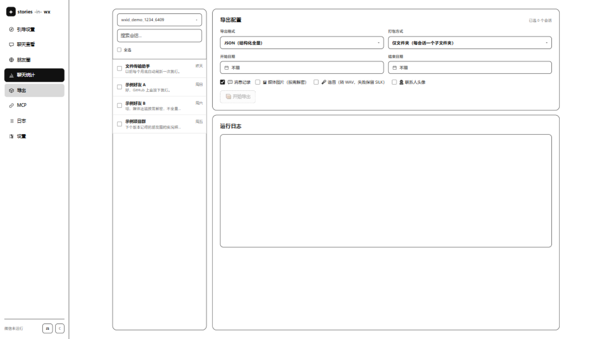

# 导出

SIWX 的导出目标是：**既适合人阅读，也适合机器继续处理**。

## 聊天记录（8 种格式）

在「导出」页多选会话，勾选是否导出媒体 / 语音，可打包 ZIP。

| 格式 | 适合用途 |
| --- | --- |
| JSON | 保留结构化字段，适合程序处理、二次开发、AI 管道 |
| HTML | 自包含聊天查看页，适合长期归档和直接阅读 |
| TXT | 最朴素的纯文本备份，方便全文搜索 |
| CSV | Excel、Numbers、WPS、数据库工具都容易打开 |
| Markdown | 写作、笔记、知识库沉淀友好，按日期组织 |
| TOML | 配置风格结构化文本，适合可读性强的归档 |
| SQLite | 适合 SQL 查询、统计分析、长期结构化保存 |
| XLSX | 直接作为 Excel 工作簿查看和筛选 |

**8 种格式全部支持媒体与语音引用**：勾选后，图片以文件路径/`mediaFile` 字段落盘引用，语音会转成 WAV 一并输出（转码失败则保留原始 `.silk` 并在导出结果中说明）。

## 朋友圈（4 种格式）

朋友圈数据形状与聊天不同，因此走独立的导出模块，支持 **JSON / Markdown / TXT / HTML**，可按关键词、发布者、时间范围过滤，并可选是否一并导出媒体（图片 / 视频 / 实况照片）。

## 媒体与语音导出说明

- 图片、表情、头像等资源会尽量从微信本地资源库按需恢复。
- 语音从 `VoiceInfo.voice_data` 读取明文 SILK，默认用 **pilk** 转 WAV；无需 ffmpeg 等外部依赖。
- 若本机确实无法转码，则保留原始 SILK 文件，不会静默丢数据。
- 朋友圈媒体从 CDN 下载，失败会留痕而不会静默丢弃（原因见[朋友圈](/guide/sns#已知边界-如实说明)）。

## 导出 HTML 的注意事项

HTML 导出面向归档场景，可以离线打开；若同时导出媒体，请保留导出目录结构或使用 ZIP 包，避免资源路径丢失。

## 导出产物的安全

导出文件是**明文聊天记录**，请妥善保管：不要上传到不受信任的网盘或第三方服务，公共设备上用完即删。详见[隐私与安全](/guide/privacy)与[免责声明](/guide/disclaimer)。
